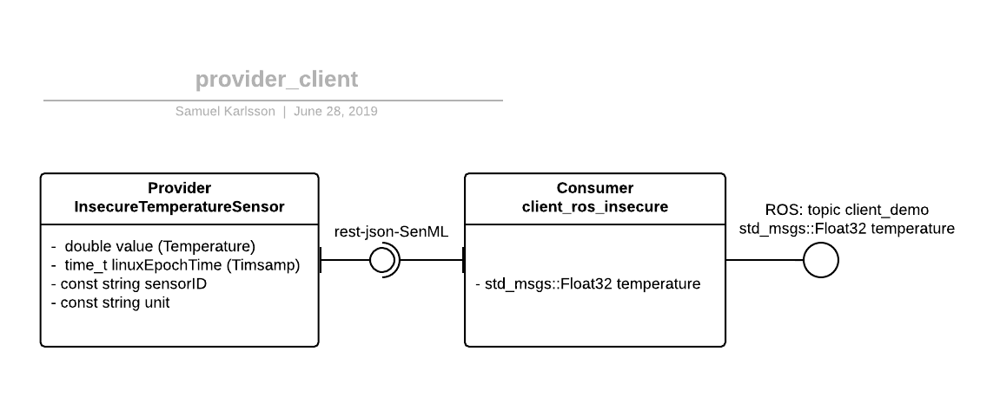
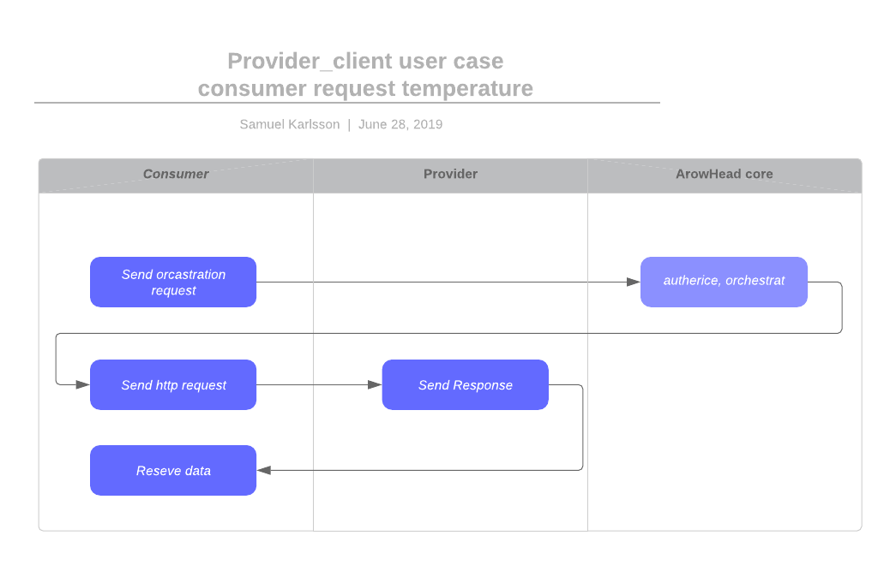

# Implementation documentation for provider_client
## SoSD
''provider_client'' is a system that contains one provider and one consumer.
The consumer are a legacy devise to ROS.
The provided resource in a dummy float.
These system is developed to be a prof of concept, skeleton and demo of arrowhead connecting ROS as a legacy devise.
Thanks to the main peeress of these system is the focus on the consumer (often called client do to ROS terminology).
It is the intended meaning to replace the provider with something useful when an actual implementation are done.
There for is the documentation angel to understand how the consumer works.


UML diagram of the system.


A sequence diagram for a request form consumer from provider.


There is currently no active security protocol working.

## SoSDD
To achieve the ROS-Arrowhead framework interaction is the [client-cpp](https://github.com/arrowhead-f/client-cpp) code used ass a base.
The ConsumerExample.cpp is rewritten to become a ROS nod.
The arrowhead connection code is kept and the rest of the file in client-cpp are functional unchanged.
A ''.launch'' file was added to simplify setting management.
The messages file are to convert between Arrowhead json-SenML and ROS messages.


Internally is the consumer utilising the orchestrator, that in its tern utilises authorization and servisRegestry, to communicate with the provider.


## SysD
The provider has the system_name InsecureTemperatureSensor and provides the services IndoorTemperature_ProviderExample.
The interface protocol is ''rest-json-SenML''.
The json return messages has the stricture: 
```
 {
 	"e":[{
 		"n": "this_is_the_sensor_id",
 		"v":$temperature,
 		"t": "$time_stamp"}],
	"bn": "$serviceID",
 	"bu": "Celsius"
}
```
The consumer has the system name ''client_ros_insecure''.
It consumer the service ''IndoorTemperature_providerExample''.
The consumer transform the incoming messages to a ROS messages of type std_msgs::Float32.
The ROS messages are published on topic ''client_demo''.

## SysDD
TODO these section shod describe the code in detail.

## IDD
To implement your one ROS consumer can you copy these project and remove the example provider.
Then you change the values in [launch/provider_client.launch](launch/provider_client.launch) to mach your system.
You can all sowed change the projects name but remember to change it in [provider_client.launch](launch/provider_client.launch), in [CMakeLists.txt](CMakeLists.txt) and in [package.xml](package.xml) ass well ass the name of the folder and launch file.

Then is it necessary (probably) to modify the [messages.cpp](src/messages.cpp) and [messages.hpp](src/messages.hpp) to match your resources messages.
How ever be careful with changing names on the fill or the function.
[SensorHandler](src/Consumer/SensorHandler.h) is including and using it.
And finally is it only to extend the ROS system as if it where a regular ROS node ([learn how](http://wiki.ros.org/ROS/Tutorials)).

If you desire to utilise a different interfaces do you have to update code in other files to.
At writhing moment do I not know how.
Sow if you know, pleas writ it down!
I haven't tested all settings in the launch file sow there mighty be some that's not easily changed.
